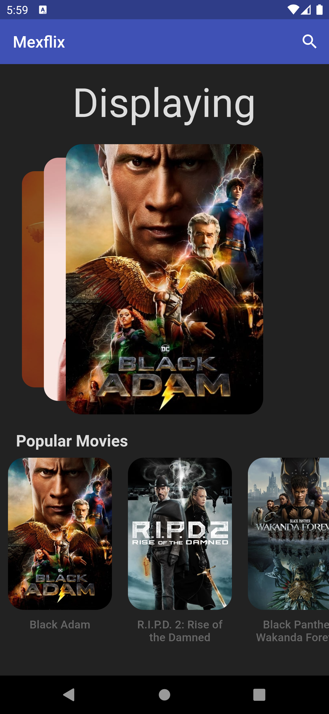
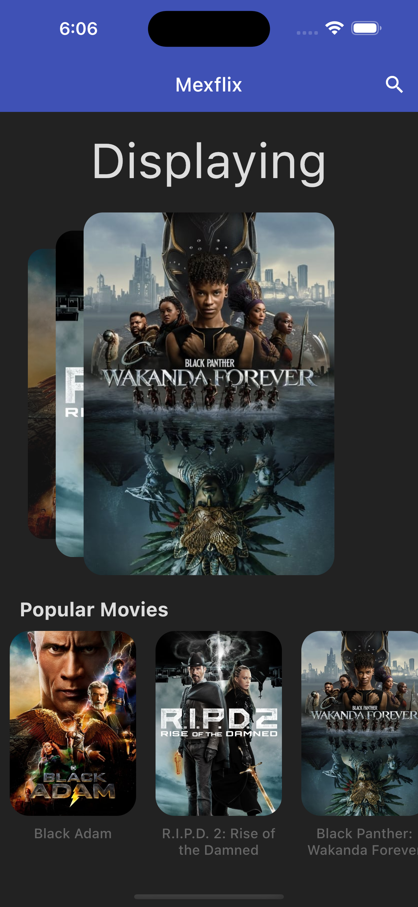

# Movies App

## Run Code
```bash
> flutter run
```

## Screens

<table>
  <tr>
    <td>
      <h3 style="text-align:center">Android</h3>
      
    </td>
    <td>
      <h3 style="text-align:center">IOS</h3>
      
    </td>
  </tr>
</table>
